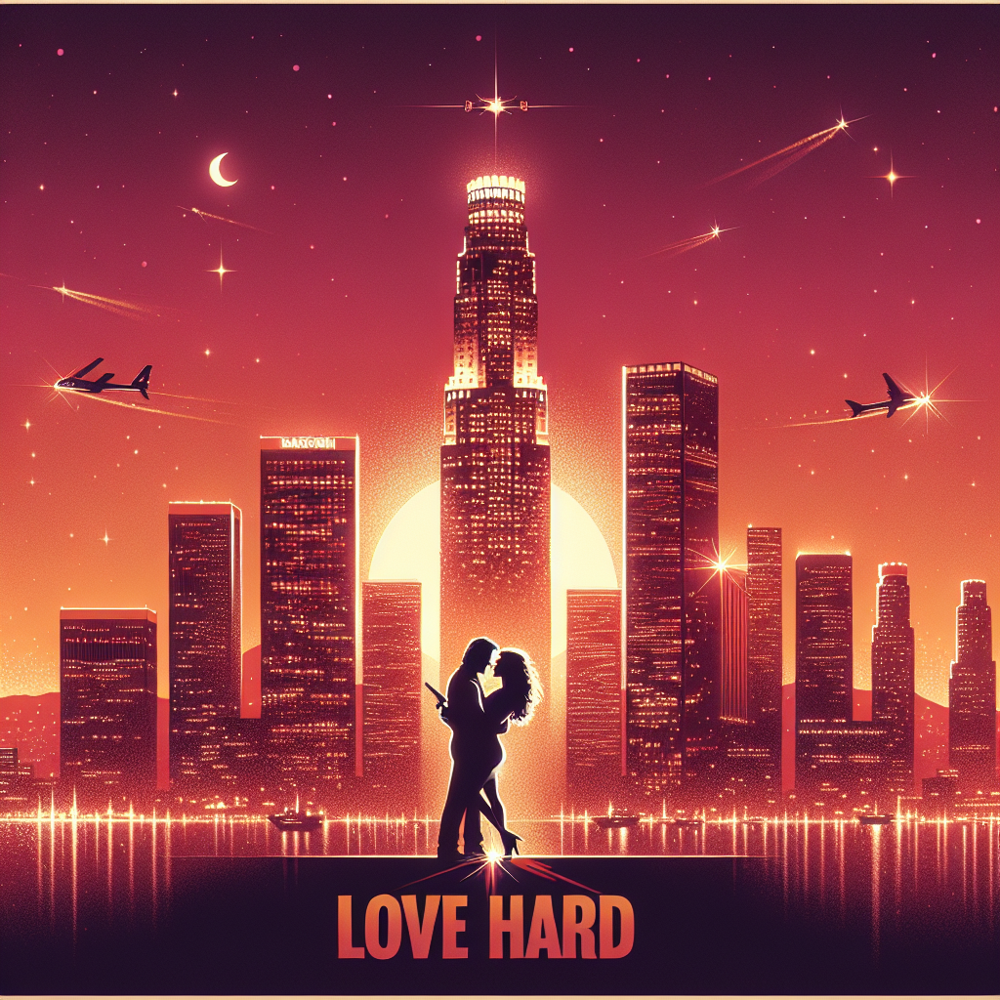

# 💝 Romantic Movie Night Generator

Turn any movie into a romantic masterpiece! This delightfully charming web application transforms your favorite movies into their romantic alternatives, complete with love-struck titles, swooning descriptions, and dreamy poster art.

## ✨ Features

- **Poster Analysis**: Uses AI to understand the visual elements, composition, and mood of your original movie poster
- **Story Transformation**: Reimagines your movie's plot with a romantic twist
- **AI-Powered Poster Generation**: Creates a new, romantically-themed movie poster
- **Real-time Preview**: See your original and romantic versions side by side
- **Detailed Analysis**: Get insights into how the AI interprets your poster's visual elements

## 🎬 Examples

Turn action movies into romantic comedies:
- "Die Hard" → "Love Hard"

You can find a running version of the application here:
- https://zealous-mud-0785a3603.4.azurestaticapps.net/

## 🚀 Getting Started

1. Configure your Azure OpenAI credentials:
   - API Key
   - Endpoint URL
   - Model name (default: gpt-4o-mini)

2. Prepare your movie details:
   - Upload an original movie poster
   - Enter the movie title
   - Add a brief description

3. Click "Generate Romantic Version" and watch the magic happen!

## 💫 How It Works

1. **Analysis Phase**: 
   - AI examines your original poster's composition, colors, and mood
   - Identifies key elements that can be romantically reinterpreted

2. **Transformation Phase**:
   - Reimagines the movie title with a romantic twist
   - Transforms the plot into a love story while keeping core themes

3. **Generation Phase**:
   - Creates a new poster with romantic elements
   - Maintains callbacks to the original while adding dreamy, romantic touches

## 🎨 Technical Features

- Responsive design for all screen sizes
- Real-time preview updates
- Step-by-step progress indicators
- Detailed poster analysis toggle
- Error handling and loading states
- Soft, romantic UI theme

## 🔧 Requirements

- Azure OpenAI API access
- Modern web browser
- Internet connection
- A sense of romance! 💕

## ⚡️ API Usage

The application uses three Azure OpenAI endpoints:
- Chat completions for poster analysis
- Chat completions for story transformation
- DALL-E 3 for image generation

## 🌟 Contributing

Got ideas to make this even more romantic? We'd love to hear them! Feel free to:
- Submit feature requests
- Report bugs
- Suggest romantic movie transformations
- Share your generated posters

## 💝 Credits

Built with love using:
- Azure OpenAI
- HTML/CSS/JavaScript
- A sprinkle of romance
- Many cups of coffee ☕

Remember: Every movie is just a romance waiting to happen! 💕